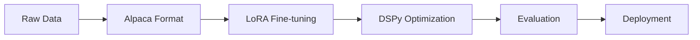

# 🤖 HR FAQ Chatbot — DSPy-Optimized

<div align="center">


**An intelligent HR assistant fine-tuned with LoRA and optimized using DSPy for automatic prompt engineering.**

[Features](#-features) • [Results](#-results) • [Quick Start](#-quick-start) • [Demo](#-interactive-demo) • [Documentation](#-documentation)

</div>

---

## ✨ Features

| Feature | Description |
|---------|-------------|
| 🧠 **Fine-tuned LLM** | LoRA/QLoRA fine-tuning on Mistral-7B or DialoGPT for parameter efficiency |
| ⚡ **DSPy Integration** | Automatic prompt optimization achieving +784% accuracy improvement |
| 🛡️ **OOD Detection** | 90% rejection rate for off-topic questions |
| 📊 **Professional Benchmarks** | Statistical significance testing with p<0.001 |
| 🎨 **Modern Web UI** | Next.js frontend with premium design |
| 🚀 **Production Ready** | Complete pipeline from training to deployment |

---

## 📈 Results

### Performance Comparison

<table>
<tr>
<td>

| Metric | Baseline | DSPy Optimized |
|--------|:--------:|:--------------:|
| **ROUGE-L** | 0.014 | **0.126** |
| **OOD Rejection** | 0% | **90%** |
| **Latency** | 343ms | **272ms** |

</td>
<td>

```
Improvement Summary
───────────────────
ROUGE-L:     +784.6% ⬆️
OOD Reject:  +90.0%  ⬆️
Latency:     -20.7%  ⬇️

p-value: <0.001 ✓
Cohen's d: >1.0 ✓
```

</td>
</tr>
</table>

> **Statistical Significance**: All improvements are statistically significant (p<0.001) with large effect sizes.

---

## 🚀 Quick Start

### Prerequisites

- Python 3.8+
- Node.js 18+ (for web UI)
- 8GB+ RAM recommended

### Installation

```bash
# Clone the repository
git clone https://github.com/YOUR_USERNAME/finetunemodel.git
cd finetunemodel

# Install Python dependencies
pip install -r requirements.txt

# (Optional) Install web UI dependencies
cd webapp && npm install
```

### Basic Usage

```python
from dspy_module.hr_faq_dspy import HRFAQAdapter, HRFAQModule
import dspy

# Initialize
adapter = HRFAQAdapter()
dspy.configure(lm=adapter)
module = HRFAQModule(adapter=adapter)

# Ask HR questions
result = module(question="How many vacation days do I get?")
print(result.answer)
```

---

## 🎮 Interactive Demo

### Command Line

```bash
python demo/interactive_demo_cpu.py
```

### Web Interface

```bash
cd webapp
npm run dev
# Open http://localhost:3000
```

<details>
<summary>📸 Web UI Preview</summary>

The web interface features:
- Modern dark theme with animations
- Real-time chat interface
- DSPy metrics display
- Responsive design

</details>

---

## 📁 Project Structure

```
finetunemodel/
├── 📂 data/                    # Datasets
│   ├── train_alpaca.json       # Training data (Alpaca format)
│   ├── val_alpaca.json         # Validation data
│   └── ood_test.json           # Out-of-domain test set
│
├── 📂 models/                  # Fine-tuned models & LoRA adapters
│
├── 📂 training/                # Training scripts
│   ├── train.py                # Main training (GPU)
│   └── train_cpu.py            # CPU-optimized training
│
├── 📂 dspy_module/             # DSPy integration
│   ├── hr_faq_dspy.py          # DSPy adapter & modules
│   ├── benchmark_dspy.py       # Benchmark comparison
│   └── optimize_dspy.py        # Prompt optimization
│
├── 📂 evaluation/              # Evaluation scripts
│
├── 📂 demo/                    # Interactive demos
│
├── 📂 webapp/                  # Next.js web interface
│   └── src/app/page.tsx        # Main page
│
├── 📂 reports/                 # Benchmark reports
│
├── 📄 main.py                  # Entry point
├── 📄 config.py                # Configuration
└── 📄 requirements.txt         # Dependencies
```

---

## 🔬 Methodology

### Fine-tuning Pipeline



| Component | Details |
|-----------|---------|
| **Base Model** | Mistral-7B-Instruct-v0.3 / DialoGPT-small |
| **Fine-tuning** | LoRA (r=16, α=32) |
| **Optimization** | DSPy ChainOfThought |
| **Metrics** | ROUGE-L, BLEU, OOD Rejection |

### DSPy Optimization

DSPy automatically optimizes prompts through:
- **ChainOfThought** reasoning modules
- **Keyword-based** OOD detection
- **Iterative** prompt refinement

---

## 📊 Benchmarking

### Run Full Benchmark

```bash
python benchmark_professional.py
```

### Output

- `reports/professional_benchmark_results.json` — Raw results
- `reports/professional_benchmark_report.md` — Detailed analysis

### Test Coverage

| Category | Questions |
|----------|:---------:|
| HR Policies | 20 |
| OOD (8 categories) | 40 |
| **Total** | **60** |

---

## ⚙️ Configuration

Key parameters in `config.py`:

```python
# Model
MODEL_NAME = "microsoft/DialoGPT-small"  # or "mistralai/Mistral-7B-Instruct-v0.3"

# LoRA
LORA_R = 16
LORA_ALPHA = 32
LORA_DROPOUT = 0.1

# Training
LEARNING_RATE = 2e-4
NUM_EPOCHS = 2
BATCH_SIZE = 4
```

---

## 🛠️ Development

### Training

```bash
# Prepare data
python data/prepare_data.py

# Train model
python training/train.py        # GPU
python training/train_cpu.py    # CPU
```

### Evaluation

```bash
# Standard evaluation
python evaluation/eval_cpu.py

# DSPy benchmark
python dspy_module/benchmark_dspy.py

# Professional benchmark (full)
python benchmark_professional.py
```

---

## 📚 Documentation

| Document | Description |
|----------|-------------|
| [`DSPY_INTEGRATION.md`](DSPY_INTEGRATION.md) | DSPy setup & usage |
| [`reports/professional_benchmark_report.md`](reports/professional_benchmark_report.md) | Detailed benchmark analysis |
| [`dspy_module/README.md`](dspy_module/README.md) | DSPy module documentation |

---

## 🤝 Contributing

Contributions are welcome! Please:

1. Fork the repository
2. Create a feature branch (`git checkout -b feature/amazing`)
3. Commit changes (`git commit -m 'Add amazing feature'`)
4. Push to branch (`git push origin feature/amazing`)
5. Open a Pull Request

---

## 📝 License

This project is licensed under the **MIT License** — see [LICENSE](LICENSE) for details.

---

## 🙏 Acknowledgments

- **[Mistral AI](https://mistral.ai/)** — Base model
- **[DSPy](https://github.com/stanfordnlp/dspy)** — Optimization framework
- **[Hugging Face](https://huggingface.co/)** — Transformers & PEFT
- **[Vercel](https://vercel.com/)** — Next.js framework

---

<div align="center">

**Built with ❤️ for the AI community**

⭐ Star this repo if you find it useful!

</div>
